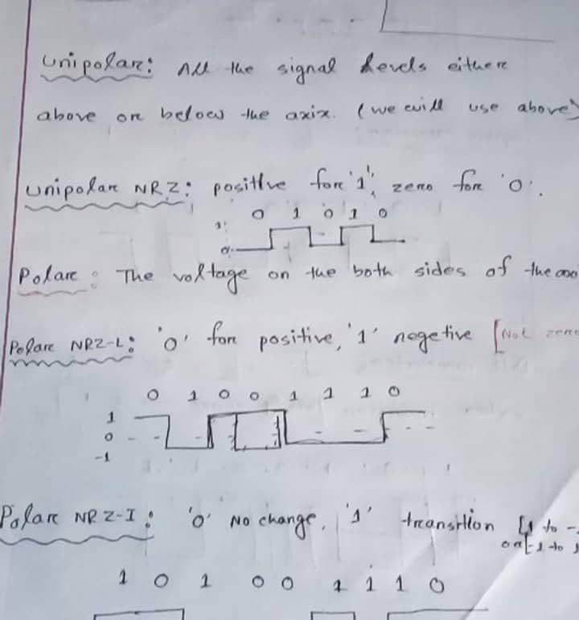
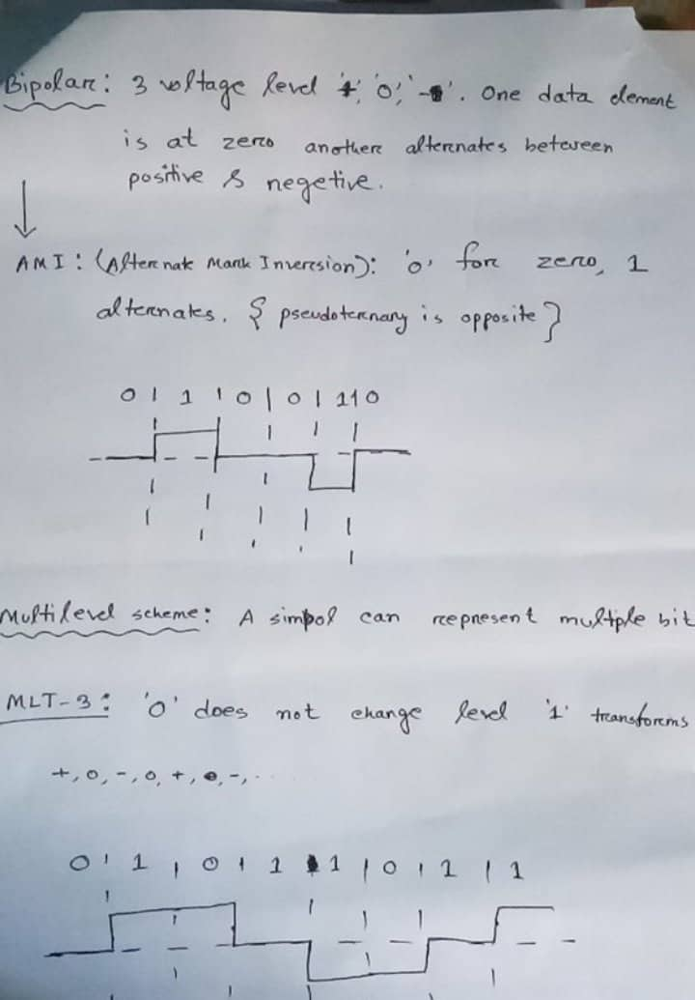
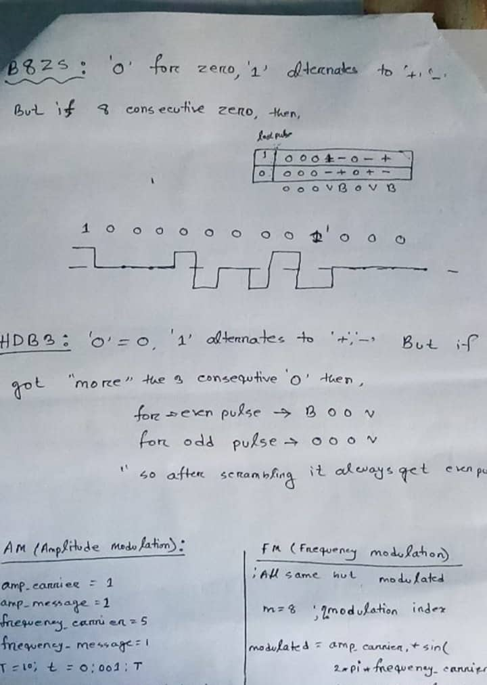

# ICE3262 lab practise

1. [x] [Basic concepts of analog/digital signal, composite signal.](https://youtu.be/rHzQkFgt4Lo)
2. [x] Implementation of modulation and demodulation for the following line coding techniques:
    - [x] Unipolar NRZ 
    - [x] Polar NRZ-L 
        - [x] NRZ-I, 
    - [x] Polar RZ, Manchester, Differential Manchester and 
    - [x] Bipolar AMI 
    - [x] Multi-transition MLT-3 
3. [x] Implementation of encoding and decoding using B8ZS and HDB3 scrambling techniques. 
4. [x] Implementation of modulation using AM and FM 
5. [ ] Implementation of modulation and demodulation using ASK, FSK and PSK

## Theoritical Basics

